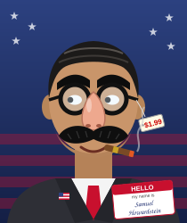
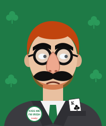
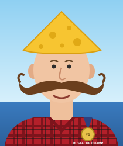

# Howardstein 2004

*A Campaign Trail mod.*

> **December 13, 2003.** U.S. forces raid a farmhouse outside Tikrit and find a spider hole. It is empty,
> except for a half-eaten candy bar and a receipt from a Newark novelty shop: *1x "Groucho" disguise glasses, $1.99.*

Three months later a mysterious independent named **Samuel Howardstein** announces a run for President. He sells insurance, he's a proud Ohioan, and he wears a truly enormous mustache that is attached to his glasses. His platform is to bring the troops home, defend America's mustaches, and defeat George W. Bush *for reasons that are entirely political and not at all personal.*

You play as Samuel in a three-way race against George W. Bush and John Kerry.

<p>




</p>

## How to play

1. Go to [newcampaigntrail.com](https://www.newcampaigntrail.com/) and click **Mod Loader**.
2. In the mod list, choose **Other** (the custom-code option), then open the **Details** tab.
3. Paste all of [`code1.js`](code1.js) into **Code Set 1** and all of [`code2.js`](code2.js) into **Code Set 2**. Leave **Endings Code** empty because the endings are built into Code 2.
4. Click **Load**, then **Click here to begin!**

## What's in it

- **25 questions**, from the Columbus launch rally through NASCAR at Talladega, Oprah, three debates (including one where your mustache comes unglued on live TV), a statue of you in Dayton, a suspicious hole in your backyard, and Election Day. Every answer has feedback from your communications director **Bob Sahhafferty** (a.k.a. Baghdad Bob), who thinks everything is going magnificently, and from **Linda Kowalski**, the only honest pollster on staff.
- **Three running mates**, each with their own regional strength:
  - **Gary Plunkett**, a Dayton used-car dealer who answered a classified ad reading "SEEKING AMERICAN. ANY AMERICAN." He helps in Ohio and lowers suspicion.
  - **Izzy Dewey**, a "proud Irish-American from Tikrit County" who wears the same $1.99 disguise and carries the King of Clubs everywhere. He's strong on the coasts but raises suspicion.
  - **Hank "The Handlebar" Whitfield**, a three-time national mustache champion who wears a Cheesehead. He's strong in Wisconsin, the Rust Belt and the Plains.
- **Five issues**: Iraq, the Economy, Moral Values, Homeland Security, and **Mustache Policy** (from *Ban All Mustaches* to *Mandatory Mustaches*).
- **The FBI Suspicion Meter.** Some answers win votes but make people look more closely at your face. The meter appears in every piece of advisor feedback. Suspicious answers also help Bush, because his campaign runs the clips in attack ads. If the meter is high enough after the Rumsfeld photo surfaces, **the FBI pays you a visit.**
- **Kerry's deal.** Late in the race Kerry's people offer a deal: drop out and endorse him to stop Bush together. Taking it hands most of your support to Kerry. That only beats Bush if you've already done Bush some damage.
- **9 endings**, depending on who wins, by how much, whether you took the deal, how suspicious America is, and what happens if nobody reaches 270. The Twentieth Amendment comes into it.
- Hand-drawn portraits for every candidate, embedded in the code, so nothing needs to be hosted anywhere.

## Difficulty

I balanced the mod by running the game's own vote formula over thousands of simulated campaigns. These are the results on **Normal** with Gary Plunkett:

| How you play | Samuel's popular vote | Samuel wins |
|---|---|---|
| Best answer every time, with sensible visits | ~42%, ~380 EV | always |
| Best answer 85% of the time | ~39% | ~90% |
| Best answer 70% of the time | ~36% | ~60% |
| Best answer 50% of the time | ~32% | ~10% (usually a deadlock that goes to the House) |
| Random answers | ~21% | never (Bush wins about 60%) |

Easy is more forgiving. On Impossible you can still win, but only with close to perfect play.

## Editing the mod

`code1.js` and `code2.js` are generated. Change the content in [`build.py`](build.py) (questions, answers, effects, endings, state data) or the portraits in [`art/`](art/), then run:

```sh
python3 build.py
```

The balance knobs (`SCALE_SAMUEL`, `SCALE_OPPONENT`, `SCALE_STATE`, `SCALE_SUS`, `SUS_HELPS_BUSH`, the FBI and unmasking thresholds, and the deal factors) are near the top of `build.py`.

A note on IDs: the game picks its base map by looking the mod's election, candidate and running-mate IDs up in the base game's own data. That's why Samuel reuses base 2000 Bush's ID (77) and the running mates reuse Cheney/Danforth/Ridge's IDs (81–83). If you change those IDs, the map won't load.

## Disclaimer

This is satire. Samuel Howardstein, Gary Plunkett, Izzy Dewey, Hank Whitfield, Bob Sahhafferty and Linda Kowalski are all fictional. The historical references are explained in the in-game **Further Reading** page.
